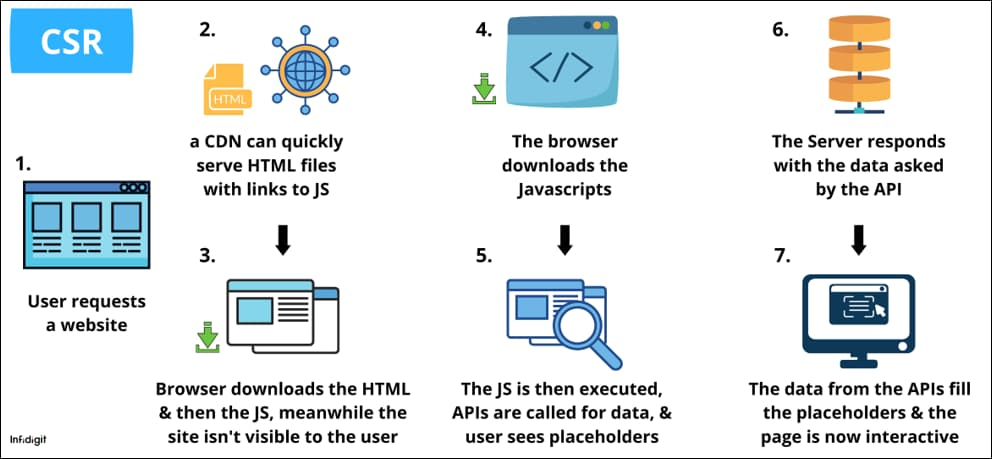
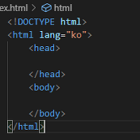
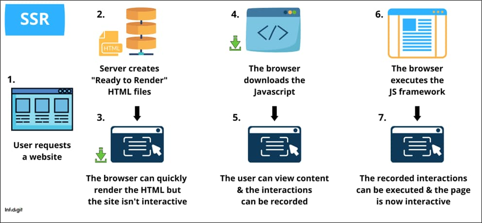

# 📖페이지 구성 방식

## **SPA(Single Page Application)**

- 원하는 부분만 클라이언트에서 동적으로 갈아 끼울 수 있는 방식(클릭한 부분만 변경)
- 웹 애플리케이션을 필요한 정적 리소스를 초반 한번에 모두 다운로드 받고 그 이후 새로운 페이지 요청이 있을 때 페이지 갱신에 필요한 데이터만 전달 받아서 클라이언트 페이지를 갱신.

※ 화면 깜빡임 없음.

## **MPA(Multiple Page Application)**

- 전통적인 웹 페이지 구성방식
- 탭을 이동할 때마다 서버로부터 새로운 html을 새로 받아와서 페이지 전체를 새로 렌더링.
- MPA를 사용하는 사이트들이 있긴 했지만 AJAX가 등장하면서 SPA방식 채택.
- MPA는 새로운 요청이 있을 때마다 서버에서 이미 렌더링 된 정적리소스를 받아옴.

※ 화면 깜빡임 있음.

# 렌더링 방식

## **CSR(client side Rendering)**

- 클라이언트 측에서 렌더링 하는 방식.

## **SSR(Server side Rendering)**

- 서버측에서 렌더링 하는 방식.

### ※CSR과 SSR은 Client와 Server 중 어느 쪽 (side)에서 rendering을 준비하냐에 따라 나눠지는 개념.

## **SSG(static site Generation)**

- static Rendering
- 서버에서 HTML을 보내준다는 측멱에서 SSR과 비슷하지만 언제 만들어 주느냐에 따라 <u>차이</u>가 있음.
   
  - SSG는 페이지들을 서버에 모두 만들어 둔 뒤에 요청시에 해당 페이지를 응답하는 것이기 때문에 바뀔 일이 거의 없어서 <u>캐싱</u> 해두면 좋은 페이지 사용 적합. 
    ※캐싱 : 컴퓨팅에서 캐싱은 오랜 시간이 걸리는 작업의 결과를 저장해서 시간과 비용을 절감하는 기법을 말한다. 
  - SSR은 요청 시 서버에서 즉시 HTML을 만들어서 응답하기 때문에 데이터가 달라지거나 자주 바뀌어서 미리 만들어 두기 어려운 페이지에 적합.

# 페이지 구성 방식 !== 렌더링 방식

## **SPA !== CSR**

## **MPA !== SSR**

이 두 개념은 페이지 몇개냐? 또는 렌더링을 어디서 하냐에 따라 달라질 수 있기 때문에 다른 개념이다.

# ▶CSR

- 서버는 빈 뼈대(서버부하가 적음)만 있는 HTML로 응답을 보내준다.
- 브라우저가 연결된 JS링크를 통해 서버로부터 다시 JS파일을 다운로드 받고 JS를 이용해 동적으로 페이지를 만들어서 브라우저 렌더링한다. 

단점 : 브라우저가 JS파일을 다운받고 동적으로 DOM을 생성하는 시간을 기다려야 하기 때문에 초기 로딩 속도가 느림. 하지만 이 후 구동 속도 빠름.

장점 : 클라이언트 측에서 연산 라우팅 등을 모두 직접 처리하기 때문에 반응속도가 빠르고 UX도 우수하다.

## 웹 크롤러

웹 크롤러는 조직적,자동화된 방법으로 월드 와이드 웹을 탐색하는 컴퓨터 프로그램이다. 

브라우저들이 가지는 웹 크롤러는 HTML을 읽어서 검색 가능한 색인을 만들어냄.

웹 크롤러 봇 입장에서 본 HTML은 텅텅 비어있음.(검색엔진이 색인을 할만 한 콘텐츠가 존재하지 않는다는 것)

결론) 이 때문에 CSR은 검색엔진 최적화(SEO)에 불리
ex)열심히 서비스를 개발했는데 검색 사이트에 노출되지 않는다.

단) Google의 크롤러의 봇은 자바스크립트를 실행할 줄 안다.

# ▶SSR

- 서버에서 렌더링 준비를 마친 HTML을 브라우저의 응답으로 전달하는 부분에서 모든 데이터가 HTML에 담겨진 채로 브라우저에 전달되기 때문에 <u>검색엔진 최적화</u>에 유리.
  - **SEO(검색 엔진 최적화)** : 검색엔진이 이해하기 쉽도록 홈페이지의 구조와 페이지를 개발해 검색 결과 상위에 노출될 수 있도록 하는 작업. 
    https://library.gabia.com/contents/domain/4359/
- 자바스크립트 코드를 다운받고 실행하기 전에 사용자가 화면을 볼 수 있다는 점.
  - JS 다운로드를 기다려야 했던 CSR보다 초기 구동 속도가 빠름 
    단)사용자가 버튼을 클릭하고 이동하려 해도 아무런 반응이 없을 수 있다.
- SSR안에는 TTV(Time TO View)와 TTI 간에 시간 간격이 존재하는 단점. 
  반면)CSR은 JS가 동적으로 DOM을 생성하기 때문에 HTML은 JS로직이 모두 완전히 연결된 상태라 사용자가 보는 시점과 이용할 수 있는 시점이 동일하다.

<table>
    <tr>
        <th></th>
        <th>CSR</th>
        <th>SSR</th>
    </tr>
    <tr>
        <td>장점</td>
        <td>
            ● 화면 깜빡임이 없음 
            ● 초기 코딩 이 후 구동 속도가 빠름 
            ● TTV와 TTI사이 간극이 없음 
            ● 서버 부하 분산
        </td>
        <td>
            ● 초기 구동 속도가 빠름 
            ● SEO에 유리함
        </td>
    </tr>
    <tr>
        <td>단점</td>
        <td>
            ● 초기 로딩 속도가 느림 
            ● SEO에 불리함
        </td>
        <td>
            ● 화면 깜빡임이 있음 
            ● TTV와 TTI사이 간극이 있음 
            ● 서버 부하가 있음
        </td>
    </tr>
</table>
https://hanamon.kr/spa-mpa-ssr-csr-%EC%9E%A5%EB%8B%A8%EC%A0%90-%EB%9C%BB%EC%A0%95%EB%A6%AC/
