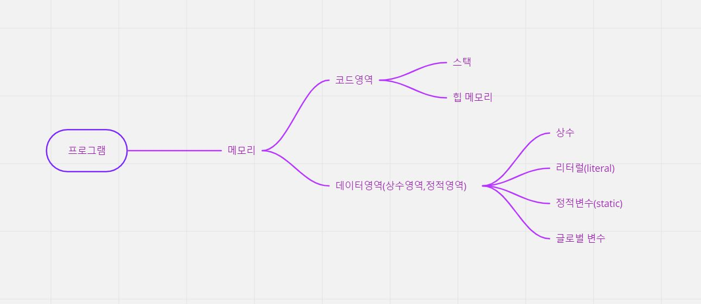

# 📖프로그래밍언어에서 사용되는 메모리

### 프로그램이 프로세스가 되어 메모리에 로드되면 크게 `코드영역`과 `데이터영역`으로 나뉜다.

## 📌코드영역

- 컴파일 된 명령어의 집합이 차지하는 공간.
- 프로그램이 실행 된다는 것은 코드 영역에 명령어가 한 라인씩 수행되는 것.
- 코드영역에는 스택과 힙 메모리가 있다.

### ✍스택 메모리

- 프로그램의 함수나 메서드가 호출될 때 지역변수, 매개변수,반환값이 차지하는 공간이다. 
  ex)함수가 호출될 때 생겨나고 함수의 호출이 끝나면 사라지는 공간. 
  결론 : 함수 별로 사용하는 공간이 다르므로 하나의 함수는 다른 함수의 변수를 알 수 없음.

### ✍ 힙 메모리(동적 메모리)

- 프로그래머가 직접 메모리를 할당 받아 사용하게 된다.
- 프로그래밍언어에 따라 new나 malbc(C언어)에 의해 메모리를 할당한다. 
  할당받은 메모리는 프로그램 전반에서 해당 주소를 참조할 필요가 있을 때 사용한다. 더 이상 필요하지 않는 경우 프로그래머가 직접 해지해야 한다.

## 📌데이터영역

- 프로그램의 로드와 함께 메모리를 차지하게 되는 영역(상수,리터럴,정적변수,글로벌변수)
- static이나 글로벌 변수에 큰 메모리를 할당 하면 안되는 이유
  - 해당 영역은 프로그램의 로드와 함께 생성되는 영역이기 때문이다.
  - 프로그램이 업로드 될 때, 모든 수행이 끝나고 메모리에서 내려갈 때 까지 유지되는 영역이기 때문이다.
