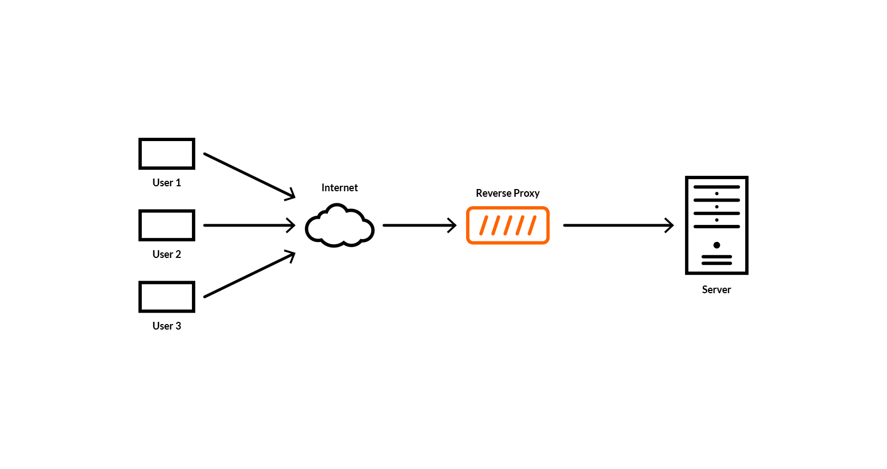

# ⚡️ Proxy

프록시 서버는 클라이언트가 자신을 통해서 다른 네트워크 서비스에 간접적으로 접속할 수 있게 해준다.

컴퓨터 네트워크에서 다른 서버상의 자원을 찾는 클라이언트의 요청을 받아 중계하는 서버를 말한다.

쉽게 말해 중계서버라고 생각하면 된다.

서버와 클라이언트 사이의 중계자 역할로 대리통신을 수행하는 것을 '프록시'라고 한다.

그 중계기능을 하는 서버를 '프록시 서버'라고 부른다.

주로 보안상의 문제로 직접 통신을 송수신할 수 없는 상황에서 프록시를 이용하여 중계 통신을 하는데 사용한다.

## 🖥 프록시 서버 종류
프록시 서버는 서버위치에 따라 크게 두가지로 나뉜다.

### Forward Proxy
프록시 서버를 '클라이언트 호스트들과 접근 하고자 하는 원격 리소스 사이에'위치 시킨다. 즉 사용자가 naver.com에 연결하려고 하면 사용자가 직접 PC에 연결하는 것이 아니라 Forward 프록시 서버가 요청을 받아 naver.com에 연결하여 그 결과를 사용자에게 전달해준다.

포워드 프록시는 대게 caching 기능이 있어 자주 사용되는 컨텐츠라면 성능향상을 가져올 수 있고 정해진 사이트만 연결가능하도록 설정하는 등 웹 사용환경을 통제할 수 있으므로 기업 내부망 환경 등에서 많이 사용된다.

### Reverse Proxy
프록시 서버를 인터넷 리소스 또는 인트라넷 리소스 앞에 위치시키는 방식, 즉 사용자가 naver.com 웹 서비스에 데이터를 요청하면, Reverse 프록시가 이 요청을 받아 내부 서버에서 데이터를 받은 후에 이 데이터를 사용자에게 전달하는 방식이다.

