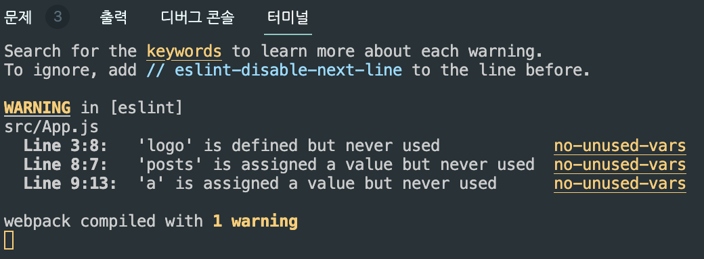

# ❗️터미널 & 브라우저 콘솔창에 waring이 뜨는 이유

개발을 하다 보면 에러메시지는 터미널이나 브라우저 개발자도구에 뜬다고 했는데 간혹 노란색 wargin 메시지가 등장하는 경우가 있다.



빨간색 error는 해결해야하지만 warning은 무시해도 된다.

대부분 eslint라는 친구가 잘못된 코딩관습을 교정해주는건데<br />
"변수를 만들었는데 안쓰고 있네요 지우는게 어떰"<br />
이런 식의 잔소리를 warning으로 띄어준다.

```jsx
/*eslint-disable*/
```

이라는 주석을 js파일 최상단에 추가해주면 eslint 기능을 잠시 끌 수 있다.
