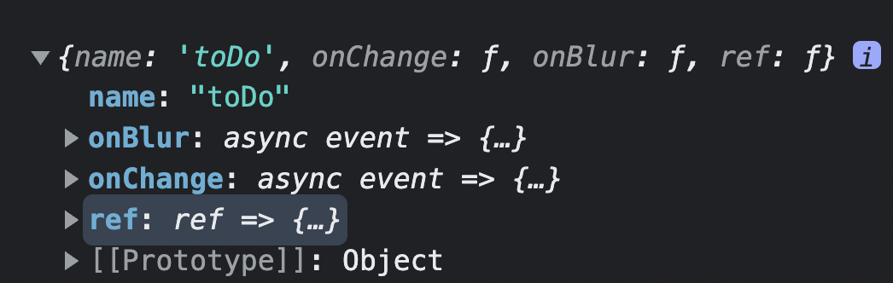

# 📖 React Hook Form
사용하기 쉬운 유효성 검사를 통해 성능이 뛰어나고 유연하며 확장 가능한 form이다.
## 📌 설치
`npm install react-hook-form`

## 📌 사용법
```tsx
const {register,watch,hadleSubmit} = useForm();
```
- **register**
    - name,onBlur,onChange,onClick,ref를 return 하는 함수
    - `<input {...register("category")}>`하면 register 함수가 반환하는 객체를 input의 props로 사용할 수 있음.
    - `console.log(register("toDo")) 출력시<br />
    
    반환을 한다.
    - ex) 위 코드는 `<input onChange={}>`를 사용하는거와 같다.
- **watch**
    - form의 입력값들의 변화를 관찰할 수 있게 해주는 함수<br />
    
- **hadlesubmit**