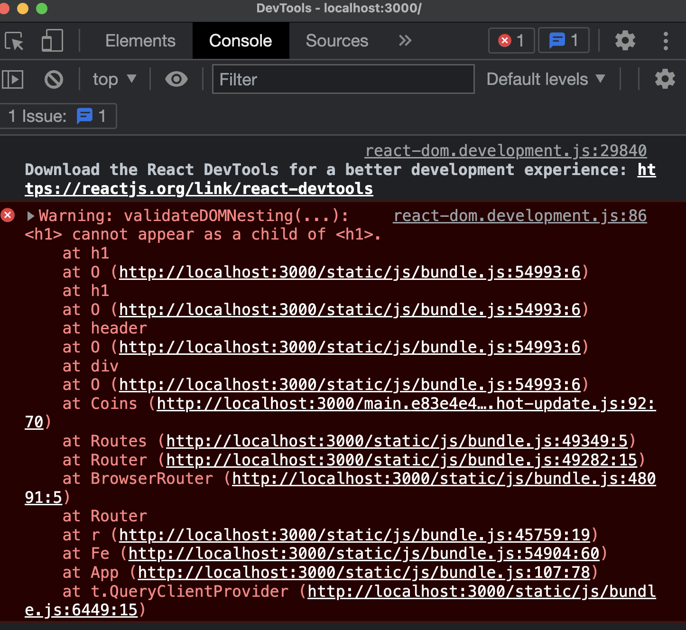

# ❗️Warning : validateDOMNesting(..)~




```
Warning:validateDOMNesting(...) : <div> cannot appear as a descendant of <p>
```

해당 에러는 \<div>는 \<p>의 하위 항목으로 나타날 수 없다는 에러이다.

이 에러는 리액트 개발 JSX에서 발생한다.<br />
즉, \<p> 태그 안에 \<div>를 사용했거나 \<p> 태그 안에 또 \<p>태그를 썼을 때 해당 에러가 발생하게 된다.


위 코드는 React에 styled-Component로 지정한 컴포넌트이다.<br />
Title component로 선언된 styled-Component의 내부는 아래와 같다.

```jsx
const Title = styled.h1`
    font-size:48px;
    color :"black";
`
```
해당 styled-component는 h1 태그안에 h1 태그를 사용하고 있기 때문에 validateDOMnesting에러가 발생한다.