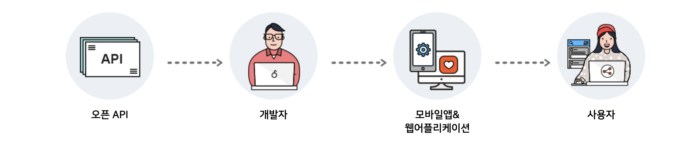

# 📖 오픈 API란

## 오픈 API란?
오픈 API란 누구나 사용할 수 있도록 공개된 API를 말합니다. 데이터를 표준화하고 프로그래밍해 외부 소프트웨어 개발자나 사용자가 바로 개발(어플리케이션)에 활용할 수 있는 형태의 개방 형식입니다. 개방된 오픈API를 이용해 다양하고 재미있는 서비스나 어플리케이션, 다양한 형태의 플랫폼을 개발 할 수 있습니다.

## 오픈 API가 유용할 때
- 업데이트가 빈번하고 활용도가 높은 대용량의 데이터를 연계 개발할 때
- 날씨난 교통 정보 등 실시간 업데이트되는 데이터를 연계가 필요할 때

