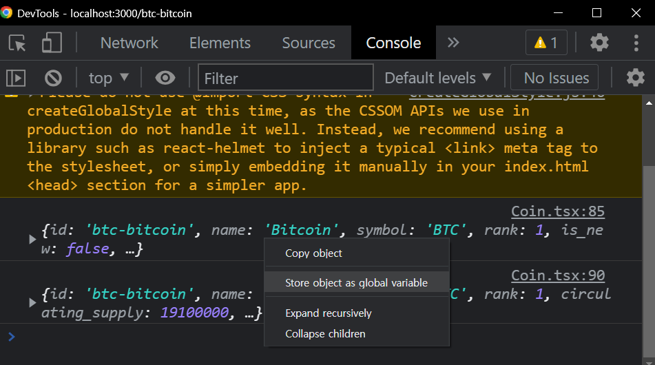
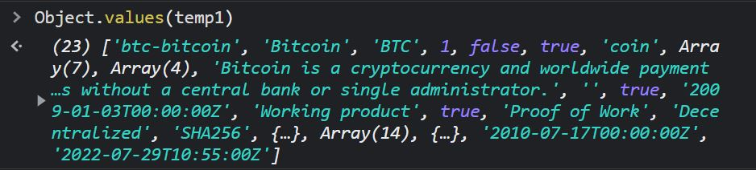
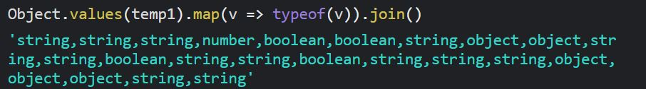

# 📖 데이터값 타입지정

### React & TypeScript 환경에서 데이터 통신 후 받아온 데이터를 state값에 넣어줄 때 각각의 데이터값에 타입을 지정해야된다.

```tsx
//Coin Component

  interface InfoData {
    id: string;
    name: string;
    symbol: string;
    rank: number;
    ....
    ....
    ....
    first_data_at: string;
    last_data_at: string;
  }


  const Coin(){
    const [info, setInfo] = useState<InfoData>(); //info는 빈 객체로 인식한다.

    useEffect(() => {
    (async () => {
      const infoData = await axios(
        `https://api.coinpaprika.com/v1/coins/${coinId}`
      );
     setInfo(infoData.data);
    })();
   }, []);
    console.log(info)
   return(
    ....
   )
  }
```

## 📌type 지정방법

### **⑴ console.log(info) 작성 후 console창에서 Store object as global variable 클릭**



### **⑵ temp1 반환된다**


### **⑶ Object.keys**


### **⑷ Object.keys.join()**

.JPG>)

### **⑸ Object.values**



### **⑸ Object.values(temp1).map(v => typeof v).join()**



## 데이터통신을 하여 type들을 받아오고 싶다면 위 처럼 명령어를 작성하여 typescript에게 하나씩 설명해줄 수도 있다. 하지만 큰 결점이 있다.


```tsx
interface PriceData {
  id: string;
  name: string;
  symbol: string;
  rank: number;
  ...
  first_data_at: string;
  last_updated: string;
  quotes: {
    USD: {
      ath_date: string;
      ath_price: number;
      market_cap: number;
      ...
      ...
      percent_change_30d: number;
      percent_change_30m: number;
      percent_from_price_ath: number;
      price: number;
      volume_24h: number;
      volume_24h_change_24h: number;
    };
  };
}
```

## array가 있기만 하면 직접 그게 뭔지 interface 더 추가하여 설명해줘야한다.
