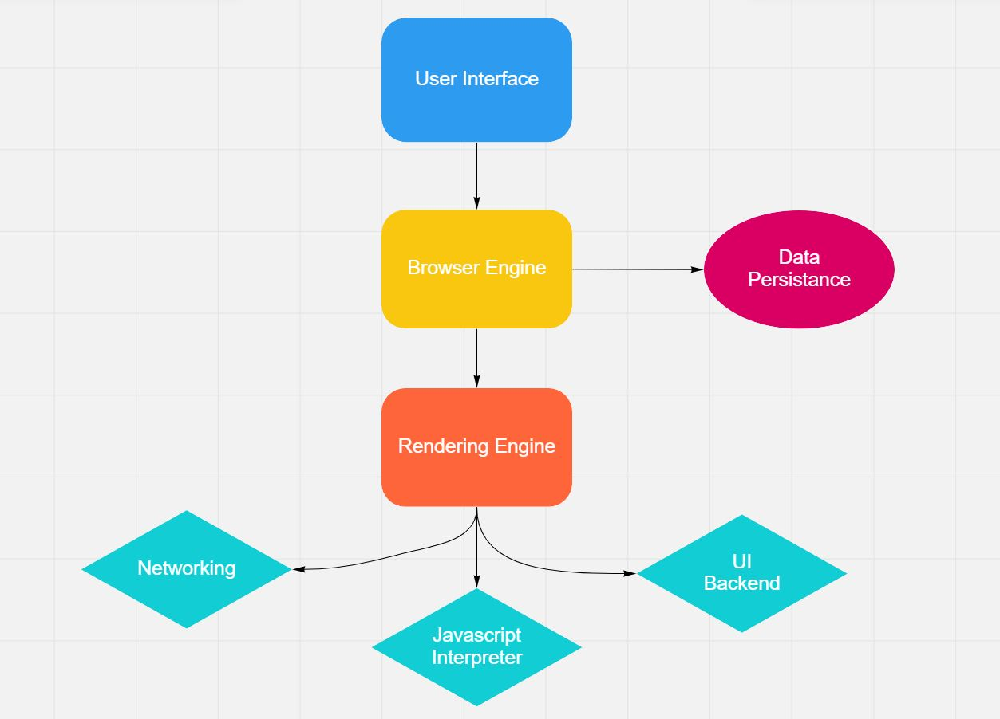
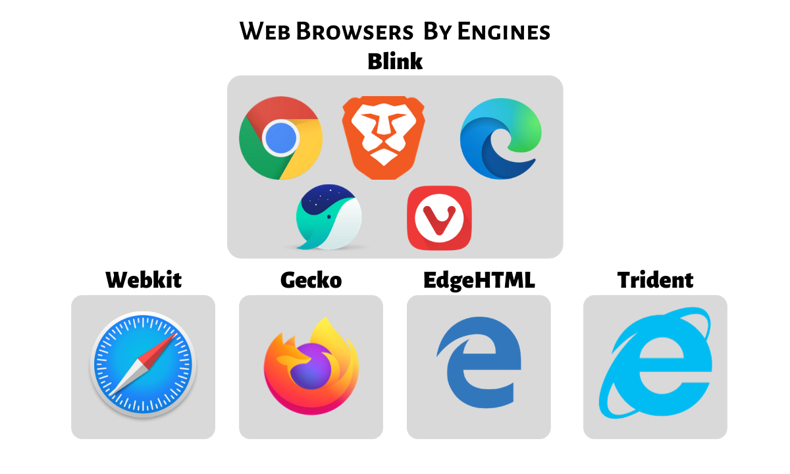

# 📖브라우저 렌더링

## 🙇렌더링

사용자가 요청한 컨텐츠를 표시하는 역할을 한다. 서버로 부터 받은 내용을 브라우저 화면에 표시 
ex) HTML을 요청하면 HTML,CSS를 파싱하여 화면에 표시하는 역할

### 📌파싱(parsing) : 어떤 큰 자료에서 원하는 정보만 가공하고 뽑아서 원하는 때에 불러올 수 있게 하는 것. 

## 🙇 브라우저의 공통적인 구조

### 📌User Interface

- 사용자가 접근할 수 있는 영역이다.
- 주소 표시줄,이전/다음/새로고침 버튼 등 웹 페이지를 제외하고 사용자와 상호작용 하는 사용자 인터페이스

### 📌Rendering Engine

- 요청한 콘텐츠를 화면에 출력
- HTML과 CSS를 파싱하여 요청한 웹 페이지를 최종적으로 표시

### 📌Browser Engine

- 웹 브라우저의 핵심이 되는 구성 요소
- User Interface와 Rendering Engine 사이의 동작을 제어
- Data Storage를 참조하며 로컬에 데이터를 쓰고 읽으면서 다양한 작업을 한다.

### 📌Networking

- http 요청
- 각종 네트워크 요청을 수행

### 📌Javascript Interpreter

- 자바스크립트 코드를 실행하는 인터프리터 
  ex)크롬에 경우 V8

### 📌 UI BackEnd

- 체크박스나 버튼과 같은 기본적인 위젯을 그려주는 UI 백엔드

### 📌 Data Persistance

- Local Storage,Indexed DB,쿠키 등 브라우저 메모리를 활용하여 저장하는 영역

## 🌟Rendering Engine

- HTML,CSS,JS,이미지 등 웹페이지에 포함된 모든 요소들을 화면에 보여준다.
- 업데이트가 필요할 때, 효율적으로 렌더링 할 수 있도록 자료구조를 생성한다. 
  ex)사용자 동작에 의해서 입력이 발생 된다던가,스크롤이 생기던가,애니메이션이 동작하던가, 비동기요청으로 인한 데이터 로딩이 있다.

※ Internet Explore service 종료

## Critical Rendering Path(CRP)

브라우저가 서버로부터 HTML 응답을 받아 화면을 그리기 위해 실행하는 과정이다.
